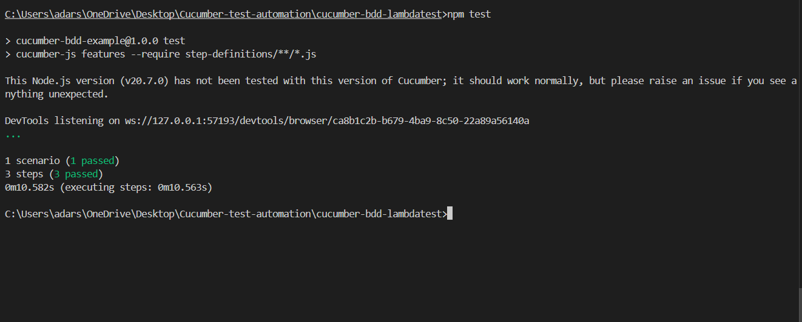

# Cucumber BDD Example

This project demonstrates how to use Cucumber with Selenium to automate login testing on LambdaTest demo site.

## 🚀 How to Run

1. Install dependencies:
```bash
npm install
```

2. Run tests:
```bash
npm test
```

## 🌐 Target Site

- https://ecommerce-playground.lambdatest.io/index.php?route=account/login
- Email: adarshguptaworks@gmail.com
- Password: password

## Screenshot
